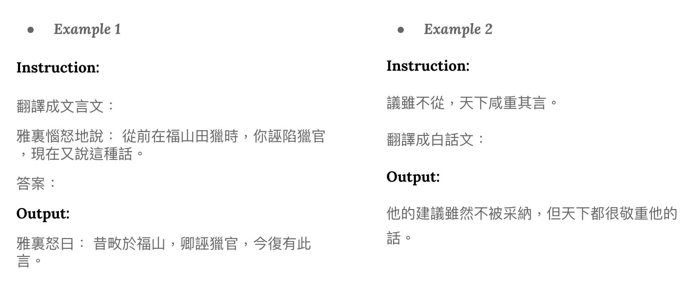

# Classical-Vernacular Chinese Translation

This project aims to translate between classical and vernacular Chinese. We applied the [Quantized Low Rank Adaptation (QLoRA)](https://arxiv.org/pdf/2305.14314.pdf) on the [Taiwan-LLM v2.0 7B](https://huggingface.co/yentinglin/Taiwan-LLM-7B-v2.0-chat/tree/5073b2bbc1aa5519acdc865e99832857ef47f7c9) model to perform parameter-efficient fine-tuning (PEFT), which largely decrease computational and storage costs.

<p align="center">
  
</p>

## **Prerequisites**

- Python 3.10

## **Repository Structure**

- **`requirements.txt`**: List of Python packages required for this project.
- **`download.sh`**: Bash script to download training data and a pre-trained PEFT adapter.
- **`run.sh`**: Bash script to run the inference code.
- **`src`**: Folder containing resources used by shell scripts and for training models on your own.
- **`report.pdf`**: Explanations of the hyperparameter sweep and generation strategies.
- **`ppl.py`**: Script to calculate the model perplexity.

## **Setup**

### **Step 1: Clone the Repository**

```bash
git clone https://github.com/Hannibal0420/Classical-Vernacular-Chinese-Translation.git
cd Classical-Vernacular-Chinese-Translation
```

### **Step 2: Install Dependencies**

Install the required Python packages and inference model using the following command:

```bash
pip install -r requirements.txt
bash ./download.sh
```

## **Run Inference**

To run the inference code, execute the **`run.sh`** script with the following arguments:

- **`${1}`**: Path to the Taiwan-LLaMa checkpoint folder
- **`${2}`**: Path to the folder containing the peft model downloaded by **download.sh**
- **`${3}`**: Path to the input file (.json)
- **`${4}`**: Path to the output file (.json)


**Note**: Make sure to replace **`/path/to/input.json`** and **`/path/to/output.json`** with the actual paths to your files. To use the example code in this repo, you can run as below.

```bash
bash ./run.sh ./Taiwan-LLM-7B-v2.0-chat ./adapter_checkpoint ./data/private_test.json ./output.json
```

## Train Your Own Model

In the **`train_src`** folder, you can fine-tune existing models or train from scratch. These codes are modified from thess sources:

- Making LLMs even more accessible with bitsandbytes, 4-bit quantization and QLoRA ([article](https://huggingface.co/blog/4bit-transformers-bitsandbytes))
- QLoRA: Efficient Finetuning of Quantized LLMs ([repo](https://github.com/artidoro/qlora))
    - [Finetuning notebook](https://colab.research.google.com/drive/1VoYNfYDKcKRQRor98Zbf2-9VQTtGJ24k?usp=sharing)
    - [Inference notebook](https://colab.research.google.com/drive/1ge2F1QSK8Q7h0hn3YKuBCOAS0bK8E0wf?usp=sharing)

## **License**

This project is licensed under the MIT License - see the [LICENSE.md](https://chat.openai.com/c/LICENSE.md) file for details.
